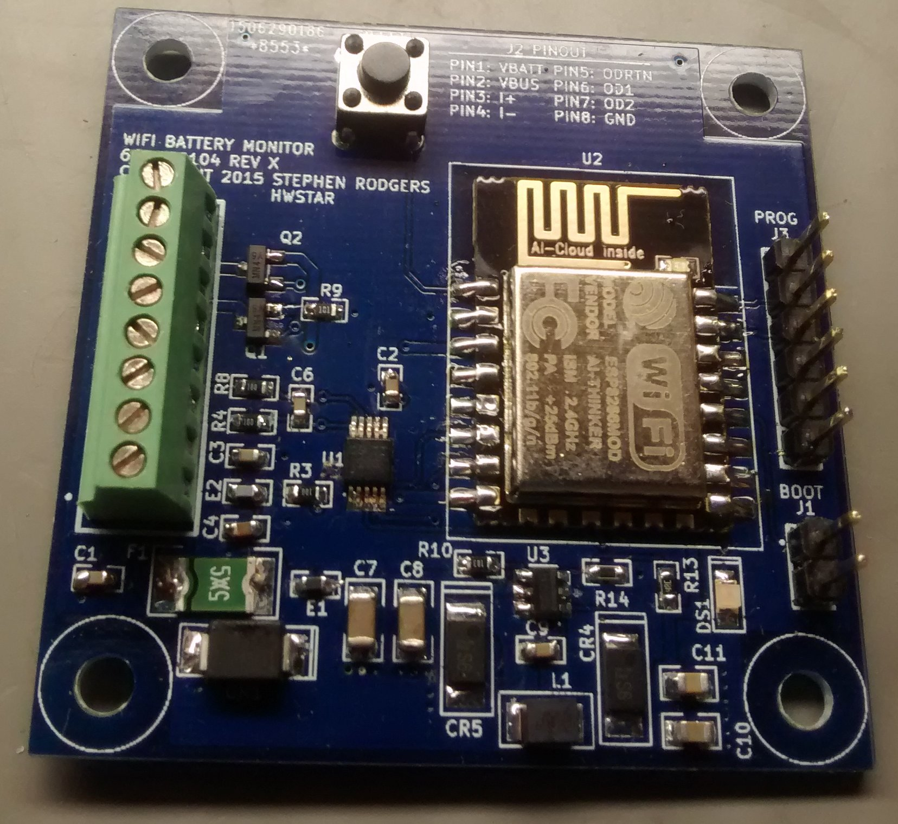

**ESP8266-MQTT-battery-monitor-hw**
==========
This is the hardware implementation for my ESP8266-MQTT-battery-monitor project.

**Features:**

This board contains an ESP12 module, DC-DC converter and an INA226 DC voltage and current monitor

**EDA Software**

This board was designed using KICAD. 

**Board Size**

5cm x 5cm

**Firmware**

The firmware for this project can be found here:

https://github.com/hwstar/ESP8266-MQTT-battery-monitor-fw

**LICENSE**

Creative Commons Attribution Share-Alike license. (CC-BY-SA)

**Disclaimer**

Build and use at your own risk. I will not be responsible for any damages including but not limited to: errors or omissions, loss of life, or property damage. You have been warned.

